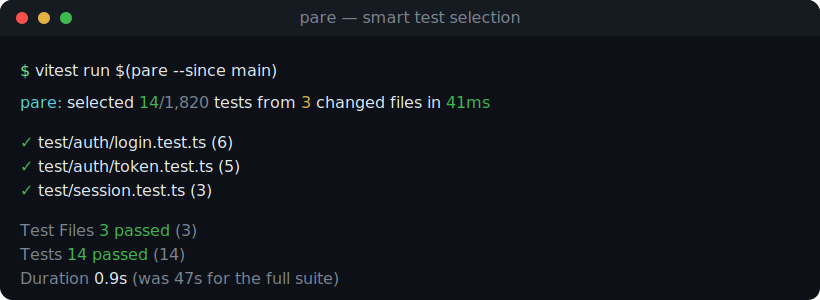

<div align="center">


# Pare

**Pare your test runs to the bone — run only the tests your diff actually touches.**

**⚡ Static-first** · **🧩 Import-graph aware** · **🛡️ Safe by default** · **📦 Zero runtime dependencies** · **🔬 Flakiness signal** · **🤖 Optional LLM booster**

<br />

[](https://github.com/TheJoeKD20/pare/actions/workflows/ci.yml)
[](https://www.npmjs.com/package/pare-cli)
[](LICENSE)
[](https://nodejs.org)
[](https://github.com/TheJoeKD20/pare/actions)

**🚀 [Quick start](#-quick-start)** · **✨ [Features](#-key-features)** · **🧠 [How it works](#-how-it-works)** · **🔬 [Flakiness](#-flakiness-signal)** · **🤖 [LLM booster](#-llm-booster-opt-in)** · **🗺️ [Roadmap](#%EF%B8%8F-roadmap)**

<br />



<sub>Pipe a diff in, get the affected tests out — **try it in 30 seconds, no account, no API key, nothing to sign up for.**</sub>

</div>

---

<details>
<summary><b>📖 Contents</b></summary>

- [The problem](#the-problem)
- [✨ Key features](#-key-features)
- [🚀 Quick start](#-quick-start)
- [🧠 How it works](#-how-it-works)
- [🧰 Commands](#-commands)
- [🚩 Flags](#-flags)
- [🔬 Flakiness signal](#-flakiness-signal)
- [🤖 LLM booster (opt-in)](#-llm-booster-opt-in)
- [⚙️ Configuration](#%EF%B8%8F-configuration)
- [🛡️ The safety guarantee](#%EF%B8%8F-the-safety-guarantee)
- [📐 Supported ecosystems](#-supported-ecosystems)
- [🗺️ Roadmap](#%EF%B8%8F-roadmap)
- [🙋 FAQ](#-faq)
- [About](#about)

</details>

---

## The problem

On a large monorepo, every pull request re-runs the **entire** test suite — thousands of
tests, most of which have nothing to do with the three files you changed. It is slow, it is
expensive, and it trains everyone to stop watching CI.

Pare reads your diff, walks the project's import graph, and prints **only the tests that
transitively depend on what you changed**. Same failures caught, a fraction of the runtime.

```console
$ vitest run $(pare --since main)
pare: selected 14/1,820 tests from 3 changed files in 41ms
✓ 14 passed (0.9s)        # the full suite took 47s
```

> Validated demand: this is a real, requested tool — see *"Smart Test Selection"* on
> [Ask HN, 2026](https://news.ycombinator.com/item?id=46345827).

---

## ✨ Key features

- **🎯 Diff-scoped selection.** Give Pare a base ref and it returns the minimal set of test files affected by the change — nothing more, nothing less.
- **🧩 Real import-graph analysis.** It parses static `import`, `export … from`, `require`, dynamic `import()` and type-only imports, then walks the **reverse** dependency graph so a change deep in a shared util pulls in every test that depends on it.
- **🛡️ Safe by default.** When a change could affect anything — a lockfile, `tsconfig`, test-runner config, or a source file outside the graph — Pare runs the **whole** suite rather than guess. It never silently skips a test it cannot reason about.
- **🪢 tsconfig path aliases.** `@app/*`, `baseUrl`, and `extends` chains resolve exactly the way your bundler sees them.
- **⚡ Fast and deterministic.** Pure static analysis, no LLM, no network. The same diff always yields the same answer — Pare pares its own 9-file suite down to 4 in ~30 ms.
- **🔌 Runner-agnostic.** Emit a plain list for `$(…)`, NUL-separated for `xargs -0`, a `--json` report for tooling, or let `pare run` invoke your runner directly.
- **🔬 Flakiness signal.** Track per-test pass/fail history (or re-run N times) and rank tests by a flake score, so you trust a pared run's failures. [Details →](#-flakiness-signal)
- **🤖 Optional LLM booster.** Off by default and never load-bearing: when enabled it *adds* heuristic suggestions for dynamic links static analysis can't see — flagged separately, validated against the real test list. [Details →](#-llm-booster-opt-in)
- **📦 Zero runtime dependencies.** One small binary. Nothing to audit, nothing to pull in transitively — the LLM booster uses `fetch`, not an SDK.

---

## 🚀 Quick start

```bash
# Run it once, no install:
npx pare-cli --since main

# …or add it to the project (the binary is `pare`):
npm i -D pare-cli
```

Wire it into your test command:

```bash
# Vitest
vitest run $(pare --since main)

# Jest
jest $(pare --since main)

# Or let Pare drive the runner (it skips the run entirely when nothing is affected):
pare run --since origin/main -- npx vitest run
```

In CI, diff against the pull request's base branch:

```yaml
- run: npx pare run --since origin/${{ github.base_ref }} -- npx vitest run
```

That's it. No config file is required to get started.

---

## 🧠 How it works

Pare is **static-first**: a deterministic core does ~90% of the work with no LLM and no
network, so results are reproducible and trustworthy.

```text
        ┌──────────────┐     git diff      ┌──────────────────┐
        │  base ref     │ ───────────────▶ │   changed files   │
        └──────────────┘                    └────────┬─────────┘
                                                      │ seeds
        ┌───────────────────────────┐                ▼
        │  project source tree       │      ┌──────────────────┐
        │  ─ parse imports/exports    │ ───▶ │  reverse import   │
        │  ─ resolve (tsconfig paths) │      │  graph (who imports│
        └───────────────────────────┘      │  whom, transitively)│
                                             └────────┬─────────┘
                                                      │ walk upstream
                                                      ▼
        safety check ◀── lockfile / tsconfig /  ┌──────────────────┐
        (full suite?)     deleted source?        │ affected test set │
                                                 └────────┬─────────┘
                                                          ▼
                                          test/a.test.ts  test/session.test.ts …
```

1. **Diff.** `git` resolves the merge-base of `HEAD` and your base ref, then lists every changed file (committed, staged, unstaged and untracked).
2. **Graph.** Pare walks the source tree, extracts every module specifier, and resolves each to a real file — honouring extensions, `index` files, `.js→.ts` mapping and `tsconfig` path aliases. It records who imports whom.
3. **Select.** Starting from the changed files, it walks the **reverse** edges to collect everything transitively affected, then keeps the test files.
4. **Safeguard.** If a change falls outside what the graph can model, it falls back to the full suite (see below).

---

## 🧰 Commands

| Command | What it does | Status |
| --- | --- | :---: |
| `pare` | Print affected test files, one per line, to stdout | ✅ |
| `pare run -- <cmd…>` | Run `<cmd>` with the affected tests appended; skips the run when nothing is affected | ✅ |
| `pare explain` | Print a human-readable breakdown of the decision | ✅ |
| `pare --json` | Emit a structured JSON report | ✅ |
| `pare flake record <junit…>` | Fold JUnit result files into the flakiness history | ✅ |
| `pare flake report` | Rank tests by flakiness (flip rate) | ✅ |
| `pare flake run -- <cmd…>` | Re-run a command N times and estimate flake rate | ✅ |

---

## 🚩 Flags

| Flag | Description | Default |
| --- | --- | --- |
| `-s, --since <ref>` | Diff against `<ref>` (uses the merge-base) | — |
| `-b, --base <ref>` | Alias for `--since` | — |
| `--json` | Emit a JSON report instead of a list | off |
| `--safety` / `--no-safety` | Toggle the full-suite fallback | **on** |
| `--llm` | Add heuristic suggestions via the LLM booster (needs `ANTHROPIC_API_KEY`) | off |
| `--cwd <dir>` | Run as if from `<dir>` | `process.cwd()` |
| `-0, --null` | NUL-separate output (for `xargs -0`) | off |
| `--absolute` | Print absolute paths | cwd-relative |
| `-h, --help` · `-v, --version` | Help / version | — |

> 💡 Diagnostics (`pare: selected 14/1,820 …`) are written to **stderr**, so `$(pare …)`
> stays clean for command substitution.

---

## 🔬 Flakiness signal

A pared suite is only trustworthy if you know which failures are *real*. Pare keeps a
local history of per-test pass/fail outcomes and surfaces a **flake score** — the
fraction of run-to-run transitions between pass and fail — so an intermittent test
stands out from one that's simply broken.

Feed it the JUnit report your runner already emits:

```bash
# Estimate flake rate by re-running the suite N times (repeat-N):
pare flake run --runs 5 --results junit.xml -- npx vitest run --reporter=junit

# …or record CI results over time, then rank:
pare flake record junit.xml
pare flake report
```

```text
score  fails  runs  conf    test
 1.00   0.50    10  high    src/session.test.ts > refreshes the token
 0.40   0.20     5  medium  src/queue.test.ts > drains in order
```

- **🎯 Flakiness is inconsistency, not failure.** A test that always fails is broken (score `0`, fail-rate `1`); a test that flips between pass and fail is flaky (high score). The score separates the two so you triage the right ones.
- **📈 Confidence grows with data.** Each test is tagged `low` / `medium` / `high` by how many runs back it. One red run isn't a verdict.
- **🗃️ Local cache, no service.** History lives in `.pare-cache/flake.json` — nothing leaves your machine, and `pare flake clear` wipes it.

---

## 🤖 LLM booster (opt-in)

Static analysis can't see **dynamic** links — reflection, dependency injection,
string-keyed registries, config-driven wiring. The optional booster asks a model which
*additional* tests a change might touch, and adds them clearly flagged as heuristic.

```bash
export ANTHROPIC_API_KEY=sk-...
pare run --since main --llm -- npx vitest run
```

- **🔒 Off by default, never load-bearing.** No flag, no model. No API key, no booster — Pare prints a notice and proceeds with the static selection. A booster failure never fails your run.
- **➕ Only ever adds.** The booster can suggest tests static analysis missed; it can never remove a statically-selected test. Suggestions are validated against the real test list — it can't invent paths.
- **🏷️ Always flagged.** `--json` and `pare explain` separate `selectedTests` (deterministic) from `llmSuggested` (heuristic), so you always know which is which.
- **📦 Still zero runtime dependencies.** The booster talks to the Anthropic Messages API over `fetch` and forces a structured tool call — no SDK pulled in. Override the model with `PARE_LLM_MODEL` (defaults to a current Claude model).

---

## ⚙️ Configuration

Zero config works out of the box. To override, drop a `pare.config.json` at the project
root (comments and trailing commas are allowed):

```jsonc
{
  // Glob patterns identifying test files
  "testMatch": [
    "**/*.{test,spec}.{ts,tsx,js,jsx}",
    "**/__tests__/**/*.{ts,tsx,js,jsx}"
  ],
  // Directories skipped while scanning
  "ignore": ["node_modules", "dist", "build", "coverage"],
  // Resolution extensions, in priority order
  "extensions": [".ts", ".tsx", ".js", ".jsx", ".json"],
  // Changes to these trigger a full-suite run under safety mode
  "globalConfigFiles": ["package.json", "tsconfig*.json", "vitest.config.*"]
}
```

| Key | Purpose | Status |
| --- | --- | :---: |
| `testMatch` | Which files count as tests | ✅ |
| `ignore` | Directories to skip | ✅ |
| `extensions` | Module-resolution extensions | ✅ |
| `globalConfigFiles` | Files that force a full run in safety mode | ✅ |

`tsconfig.json` / `jsconfig.json` `baseUrl`, `paths` and `extends` are read automatically.

---

## 🛡️ The safety guarantee

This is the trust-critical bit, so Pare is loud about it. **In safety mode (the default),
Pare runs the entire suite** whenever it cannot bound the blast radius of a change:

| Trigger | Why | Behaviour |
| --- | --- | :---: |
| Lockfile / `package.json` change | A dependency bump can affect anything | Full suite ✅ |
| `tsconfig` / runner config change | Resolution or test setup changed globally | Full suite ✅ |
| A source file **outside** the graph changed (e.g. deleted) | Its importers can't be traced reliably | Full suite ✅ |
| Everything else | Blast radius is known | Pared set ✅ |

If you want strict selection regardless (for experiments or local speed), pass
`--no-safety`. Pare will then select strictly from the graph and tell you what it skipped.

---

## 📐 Supported ecosystems

| Ecosystem | Selection | Notes | Status |
| --- | :---: | --- | :---: |
| TypeScript / TSX | ✅ | `.ts .tsx .mts .cts`, path aliases | ✅ |
| JavaScript / JSX | ✅ | `.js .jsx .mjs .cjs`, ESM + CJS | ✅ |
| Vitest | ✅ | `vitest run $(pare …)` | ✅ |
| Jest | ✅ | `jest $(pare …)` | ✅ |
| `node --test` | ✅ | any runner that takes file args | ✅ |
| Other languages | ⏳ | planned (see roadmap) | 🚧 |

---

## 🗺️ Roadmap

Pare ships a deliberately small, finishable **v0.1** — the deterministic core — and grows
from there.

| Version | Scope | Status |
| --- | --- | :---: |
| **v0.1** | Static import-graph selection · safety fallback · `run` command · JS/TS | ✅ Shipped |
| **v0.2** | Flakiness signal — local pass/fail history + repeat-N flake estimate | ✅ Shipped |
| **v0.2** | LLM booster (opt-in, flagged) — suggest tests static analysis misses via reflection / DI / string registries | ✅ Shipped |
| **v0.3** | More ecosystems (Python, Go) · monorepo project graphs · watch mode | 🔭 Exploring |

The LLM layer is intentionally **optional and clearly flagged** — it never gates adoption on
an API key, and the deterministic core stays the source of truth.

---

## 🙋 FAQ

<details>
<summary><b>Will Pare ever skip a test that should have run?</b></summary>

Not in safety mode. Static analysis can miss truly dynamic links (a string-keyed registry,
reflection, dependency injection), which is exactly why the safety fallback exists and why
config/lockfile changes run everything. For the dynamic cases, the opt-in LLM booster (v0.2)
is designed to suggest the extra tests — clearly flagged as heuristic.

</details>

<details>
<summary><b>What does it diff exactly?</b></summary>

With `--since main`, everything from the merge-base of `HEAD` and `main` up to your current
working tree — committed, staged, unstaged and untracked. With no base, just local changes
versus `HEAD`.

</details>

<details>
<summary><b>Why not just use my runner's built-in "related" mode?</b></summary>

Runner heuristics are coupled to that runner and often miss transitive edges or path
aliases. Pare is runner-agnostic, resolves `tsconfig` paths, walks the full transitive
reverse graph, and gives you a plain list you can feed anywhere — plus a documented safety
contract.

</details>

<details>
<summary><b>Does it call out to any service?</b></summary>

No. The v0.1 core is pure local static analysis: no network, no telemetry, no API key. The
future LLM layer is opt-in and off by default.

</details>

---

## About

Built by **[Joe Kane](https://joekane.org)** — making developer workflows faster, smarter
and harder to break.

<div align="center">

<br />

**[⚡ Pare your next test run →](#-quick-start)**

<sub><i>Run the tests that matter. Skip the 1,806 that don't.</i></sub>

</div>
